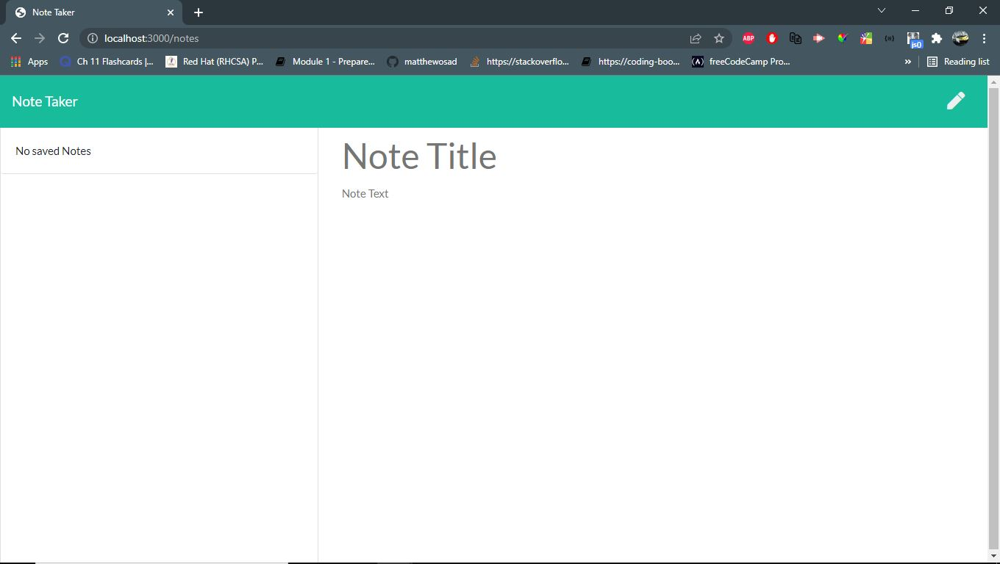

# Note Taker

 

This is for users that need to keep track of a lot of information, it’s easy to forget or be unable to recall something important. Being able to take persistent notes allows users to have written information available when needed. The application can be used to write, save, and delete notes using an express backend and save and retrieve notes data from a JSON file.

## Installation

1. Download or clone repository
2. Node.js is required to run the application
3. `npm install` to install the required npm packages

## Usage

* To start using the application, open your browser and go to
  
  `http://localhost:3000/`

* Demo of application (https://drive.google.com/file/d/1o5KnFLt2XJWG1LES9eBr9ec_HH9wVRCe/view)

  

* Websites
  * [Github](https://github.com/mathewosad/Note-taker)

## Features

* JavaScript
* Node.js
* Express

## License

  Copyright (c) Mathew Osad. All rights reserved.
  
  Licensed under the [MIT](LICENSE) license.
  
